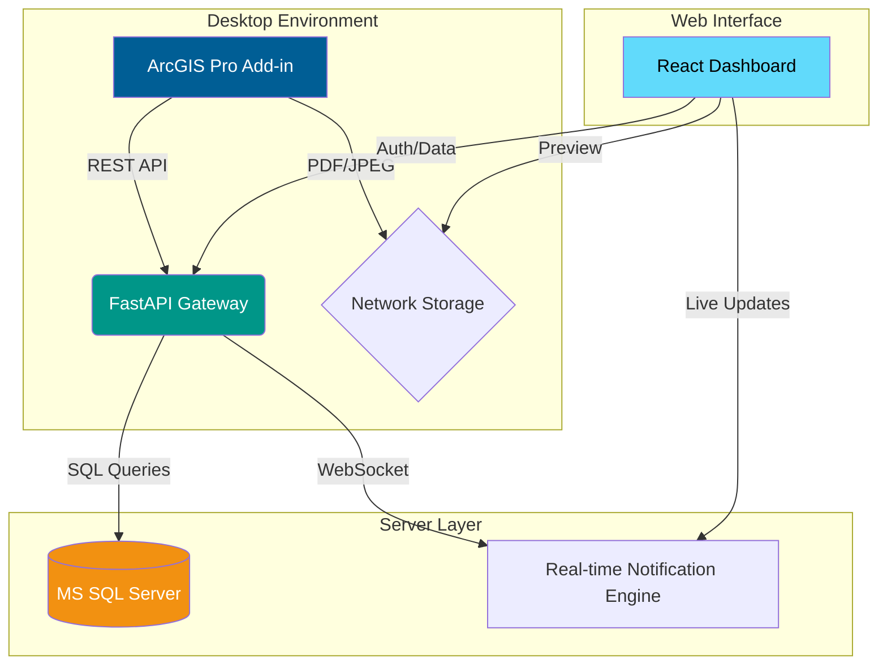

# 🛡️ Sentinel | Layout Monitoring & Archiving System

[](https://pro.arcgis.com/)
[](https://fastapi.tiangolo.com/)
[](https://reactjs.org/)
[](https://www.typescriptlang.org/)

**Sentinel** is an enterprise-grade GIS archiving ecosystem designed for ArcGIS Pro. It bridges the gap between desktop GIS analysis and organizational oversight by providing real-time archival, version control, and a collaborative decision-making dashboard.

---

## 🏗️ System Architecture



---

## ✨ Core Capabilities

### 🛠️ ArcGIS Pro Integration (Add-in)
*   **One-Click Archiving:** Export and log layouts directly from the Pro ribbon.
*   **Smart Identity:** Automatic MAC-based machine identification and secure JWT auth.
*   **Dual Workflow:** Seamlessly handle **New Layouts** or **Re-versions** of existing records.
*   **Native UI:** Fully themed WPF dialogs that respect ArcGIS Pro's light/dark modes.

### 📊 Governance Dashboard (Web)
*   **Real-time Collaboration:** Live chat and notifications via WebSockets.
*   **Deep Linking:** Persistent URLs for specific reviews (`/approval/:id`).
*   **Audit Trails:** Exhaustive history tracking for every metadata change.
*   **Media Preview:** High-performance inline PDF/Image viewer with proxy security.

### 🛡️ Enterprise Security
*   **Role-Based Access (RBAC):** Distinct permissions for Analysts and Administrators.
*   **Data Integrity:** Unique ID generation (`AB-0000`) and SQL Server ACID compliance.

---

## 🚀 Quick Start

### 1. Backend (FastAPI)
```bash
cd backend
python -m venv .venv
source .venv/bin/activate  # or .venv\Scripts\activate
pip install -r requirements.txt
uvicorn src.main:app --host 0.0.0.0 --port 8000
```

### 2. Frontend (React)
```bash
cd frontend
npm install
npm run dev
```

### 3. Add-in (C#/.NET)
Open `GIS Archiving Sys.sln` in Visual Studio and build the `ArcLayoutSentinel` project. The `.esriAddInX` file will be generated in the `bin` folder.

---

## 📂 Repository Structure

*   📂 `addin/` — ArcGIS Pro Desktop Extension (C# SDK).
*   📂 `backend/` — REST API & WebSocket Server (Python/FastAPI).
*   📂 `frontend/` — Collaborative Management Dashboard (React/TS).
*   📂 `database/` — SQL Server Schema and Migrations.

---

## 🛠️ Tech Stack

| Layer | Technologies |
| :--- | :--- |
| **Desktop** | .NET 6, ArcGIS Pro SDK, WPF, XAML |
| **Backend** | Python 3.10+, FastAPI, SQLAlchemy, MS SQL Server |
| **Frontend** | React 18, Vite, TailwindCSS, Framer Motion, Lucide |
| **Real-time** | WebSockets, JWT Authentication |

---

<p align="center">
  <i>Developed for Enterprise GIS Workflows | 2026</i>
</p>
