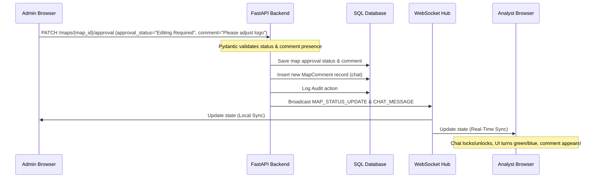

# Superpowers: Multi-Agent Brainstorming & Architecture

This document describes the design decisions, brainstorming results, and technical specification developed by our specialized virtual team.

## Virtual Specialist Agents

We hired the following virtual specialists to analyze and implement this task:

1. **Frontend Specialist (UI/UX & React)**
   - **Task:** Build interactive, real-time reactive components in `ReviewMode.tsx` and `Dashboard.tsx`.
   - **Design decisions:**
     - Enable immediate UI updates by listening to WebSocket events, bypassing manual page refreshes.
     - Enforce form validation at the view level (disable action button when "Editing Required" or "On Hold" is selected and no comment is supplied).
     - Instantly lock the comment feed and style the header with a green approved theme when `approval_status === "Approve"`.
     - Integrate a toggleable, inline preview frame (`iframe` for PDFs, `img` for images) inside the Decision Center, loading data via base64 buffer proxies.

2. **Backend Developer (FastAPI & WebSockets)**
   - **Task:** Enhance backend validation, comment storage, and WebSocket broadcasts.
   - **Design decisions:**
     - Implement Pydantic `model_validator` in `MapApprovalUpdate` to enforce that comment is not empty for "Editing Required" or "On Hold".
     - When a decision with a comment is submitted, automatically write it to the `Map_Comments` table and trigger a `CHAT_MESSAGE` broadcast so it appends to the conversation thread.
     - Broadcast a `MAP_STATUS_UPDATE` WS message containing `map_id`, `approval_status`, `approval_comment`, `status`, etc., to sync all active clients.

3. **Security Architect**
   - **Task:** Verify data isolation and input safety.
   - **Design decisions:**
     - Enforce standard tenant boundary checks during updates and broadcasts.
     - Ensure admin comments are created with the correct tenant context (`tenant_id` validation).
     - Audit log all changes to approval states.

---

## Architecture Flow

